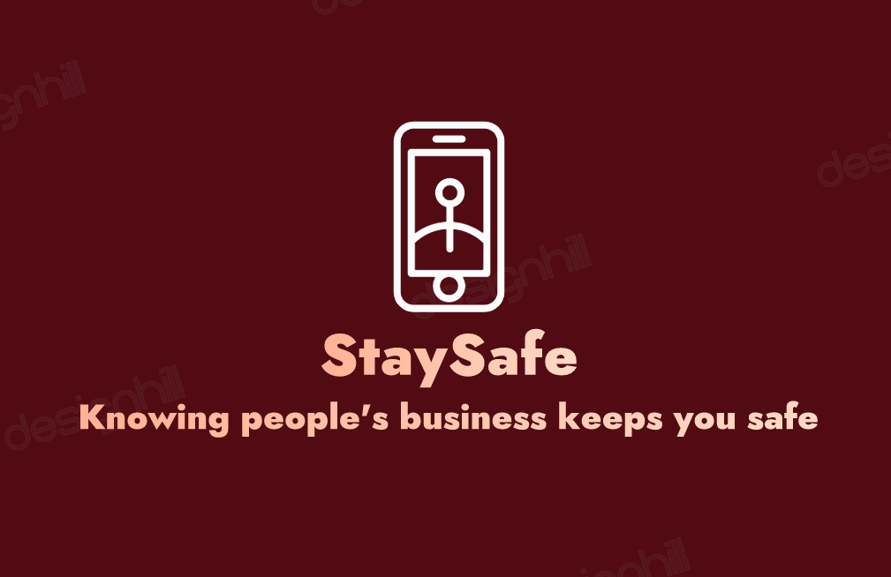

---

# Problem:

1. Do you feel unsafe travelling at night or in unfamiliar neighborhoods?

2. Do you maybe want to go on a trip with your friends but want to make sure it's not a murdering scene?
3. Or do you just want to find out if the rumoured crimes near you are true so you can take precaution?

If this is you then we've got you covered

<!-- Do you feel unsafe travelling at night or in unfamiliar neighborhoods? Due to the incline in crime rates, certain areas and roads should be avoided. But how do you know which?😎 -->

---

# Solution:

> We at **StaySafe** want exactly that... YOU to **stay safe**.

We provide an application to help you stay informed about crimes in your local area and your regularly visited places - should you wish to take precautions.

---

# Market:

Our product solves a relatable problem and applies to basically **anyone** going from one place to another with access to a smartphone.

---

# Market Size - Pre-launch

- Social Media Users
  - Up to 4.7 Billion people use social media according to [Global social media statistics research summary 2022](https://www.smartinsights.com/social-media-marketing/social-media-strategy/new-global-social-media-research/#:~:text=4.70%20billion%20people%20around%20the%20world%20now%20use%20social%20media%2C%C2%A0%20227%20million%20new%20users%20have%20come%20online%20within%20the%20last%2012%20months)
- News viewers
  - Up to 7.6 Million people watch ABC News as 2020 according to [Pew Research Center](https://www.pewresearch.org/journalism/fact-sheet/network-news/#:~:text=ABC%20evening%20news%20viewership%20grew%2016%25%20to%207.6%20million%20viewers%20in%202020%2C%20following%20an%2011%25%20increase%20in%202019.)

---

# Post-launch

- Individuals
  - Citizens
  - Campers
  - Travellers
  - Tourists
  - Commutors
- Organizations
  - Schools
  - Guides
  - Travel Agencies
  -

---

# Product:

1. View posts by our users of criminal activity
2. Get push notifications of these crimes (based on your location)
3. Check our map to view and avoid nearby crimes around you
4. Mark locations as safe/unsafe

<!-- Search for locations you want to visit and view their safety score -->

---

# Competition:

Who are our competition?

1. **Social Media Applications**
   - They aim to entertain, inform, and keep people connected
2. **News**
   - Already inform people about crime

<!-- However, **StaySafe** specializes in **tracking** crime and **alerting** users of said crimes; essentially we are a means of **self-defense.** -->

---

# Competitive Advantages

1. We focus on **tracking** crime

insert img of map and locations

2. We focus on **alerting** users of said crime

3. We also focus on **marking** locations with high crime rates

---

# Vision:

The company can expand overtime by giving the people what they **want** and **need** to **stay safe.**

<!-- We want to provide our users with the most update information on crime and safety in their local area -->

---

# Business Model

1. Advertising
2. Freemium

---

# Team:

1. Founder: Osotatanekeeni E Kari (Project Manager)
2. Co-Founder: Ellaine Fontamillas (Backend Developer)
3. CTO: Coder Kojo Matlatsa (Frontend Developer)

---

# Use of Funds:

In a few years we will be able to spend on:

- Office Space
- Hiring Employees
- Cloud Services
- Security
- Marketing/Advertising
- Upgrading devices (PCs)

---

# Summary

---

# Thank You

Contact Details
Email:
a quote about safety
